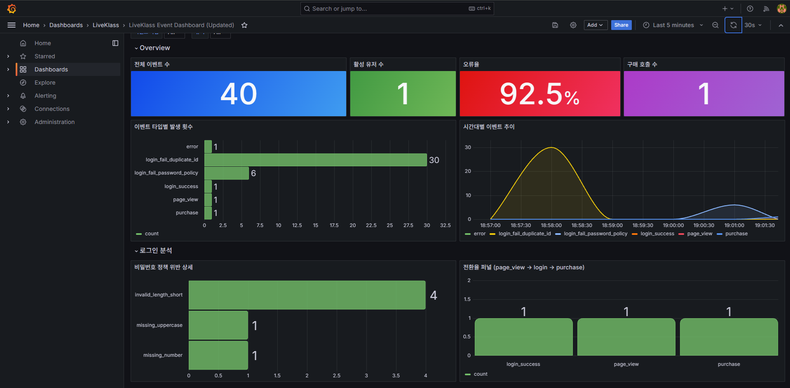

# 이벤트 로그 파이프라인

웹 서비스에서 발생하는 유저 행동 이벤트를 수집 → 저장 → 분석 → 시각화하는 파이프라인입니다.

---

## 1. 프로젝트 사용법

### 사전 요구사항

- Docker Desktop 설치 및 실행

### 실행

```bash
git clone <repository-url>
cd liveklass_project
docker compose up --build
```

Generator 컨테이너가 FastAPI 헬스체크 통과 후 자동으로 실행되어 이벤트 1,000건을 생성합니다.

### 종료

```bash
# 컨테이너만 종료
docker compose down

# 볼륨(데이터)까지 삭제
docker compose down -v
```

---

### 포트 정보

| 서비스 | 포트 | 접속 URL | ID | PW |
|---|---|---|---|---|
| FastAPI | 8000 | http://localhost:8000 | 회원가입 후 사용 | — |
| Grafana | 3000 | http://localhost:3000 | `admin` | `admin` |
| InfluxDB | 8086 | http://localhost:8086 | `.env` 참고 | `.env` 참고 |
| Telegraf | 8186 | 내부 통신 전용 | — | — |
| PostgreSQL | 5432 | 내부 통신 전용 | `.env` 참고 | `.env` 참고 |

---

### API 정보

| 메서드 | 경로 | 설명 | 인증 필요 |
|---|---|---|---|
| GET | `/` | 메인 페이지 (HTML) | — |
| GET | `/health` | 헬스체크 | — |
| GET | `/me` | 현재 로그인 상태 확인 | — |
| POST | `/register` | 회원가입 (username, password) | — |
| POST | `/login` | 로그인 (username, password) | — |
| POST | `/logout` | 로그아웃 | — |
| POST | `/trigger/{event_type}` | 이벤트 수동 트리거 | 로그인 필요 |

`event_type` 허용값: `page_view`, `purchase`, `error`

---

### 기술 스택

| 분류 | 기술 |
|---|---|
| 웹 프레임워크 | FastAPI, Uvicorn |
| 유저·인증 DB | PostgreSQL 15 |
| 이벤트 수집 에이전트 | Telegraf 1.30 |
| 이벤트 저장소 | InfluxDB 2.7 |
| 시각화 | Grafana 10.4 |
| 인프라 | Docker Compose |
| 언어 | Python 3.12 |
| 주요 라이브러리 | httpx, psycopg2-binary, bcrypt, python-dotenv |

---

## 2. 이벤트 정보

### 이벤트 타입 (6종)

| 이벤트 타입 | 트리거 | 분석 가치 |
|---|---|---|
| `page_view` | 페이지 접근 | 트래픽 패턴, 유저 흐름 파악 |
| `purchase` | 구매 버튼 클릭 | 전환율 분석 |
| `error` | 서버·앱 오류 발생 | 장애 감지 및 모니터링 |
| `login_success` | 로그인 완료 | 활성 유저 분석 |
| `login_fail_duplicate_id` | 이미 존재하는 ID 또는 한글 ID 시도 | 어뷰징 패턴 감지 |
| `login_fail_password_policy` | 비밀번호 정책 위반 | UX 개선 힌트 |

**설계 이유**: 단순 성공/실패 이분법 대신 실패 원인을 이벤트 타입 수준에서 분리했습니다. `login_fail_duplicate_id`와 `login_fail_password_policy`를 별도 타입으로 두면 태그 필터링만으로 원인별 집계가 가능합니다. `purchase`는 `page_view` 대비 전환율 측정을 위해 별도 설계했습니다.

### 비밀번호 정책 위반 상세 (`message` 필드)

정책: 대문자·소문자·숫자·특수문자 포함 / 8자 이상 15자 이하

| message 값 | 의미 |
|---|---|
| `missing_uppercase` | 대문자 없음 |
| `missing_lowercase` | 소문자 없음 |
| `missing_number` | 숫자 없음 |
| `missing_special_char` | 특수문자 없음 |
| `invalid_length_short` | 8자 미만 |
| `invalid_length_long` | 15자 초과 |

복수 위반 시 쉼표로 구분: `"missing_uppercase,missing_number"`

### Generator 동작 방식

| 항목 | 내용 |
|---|---|
| 유저 수 | 30명 (gen001 ~ gen030) |
| 총 이벤트 수 | 기본 1,000건 (환경변수 `EVENT_COUNT`로 조정) |
| 발송 방식 | 로그인 → 배치(1~15개) 단위 랜덤 이벤트 발송 반복 |
| 실패 이벤트 생성 | 한글 ID, 중복 ID 시도 → `login_fail_duplicate_id` |
| 정책 위반 생성 | 6종 나쁜 패스워드 패턴으로 → `login_fail_password_policy` |

---

## 3. 스키마 정보

### PostgreSQL — `users` 테이블

유저·인증 데이터 전용. 이벤트 로그와 분리된 별도 DB.

```sql
CREATE TABLE users (
    id            SERIAL PRIMARY KEY,
    username      VARCHAR(50) UNIQUE NOT NULL,
    password_hash VARCHAR(255) NOT NULL,
    created_at    TIMESTAMP DEFAULT NOW()
);

CREATE INDEX idx_users_username ON users(username);
```

**선택 이유**: 유저 데이터는 중복 방지(UNIQUE), 트랜잭션 일관성이 필요한 정형 데이터입니다. 이벤트 로그의 고속 write 부하가 인증 처리에 영향을 주지 않도록 DB를 분리했습니다.

---

### InfluxDB — `events` measurement

이벤트 로그 전용 시계열 저장소. FastAPI → Telegraf → InfluxDB 순으로 저장됩니다.

**저장 흐름**: FastAPI가 JSON을 Telegraf에 POST하면, Telegraf가 JSON을 파싱해 각 필드를 Tags/Fields로 분리한 뒤 InfluxDB에 씁니다. JSON을 통째로 저장하지 않습니다.

```
FastAPI POST (JSON)
┌─────────────────────────────────────────────┐
│ {                                           │
│   "event_type": "purchase",                │
│   "user_id":    "user_42",                 │
│   "status":     "success",                 │
│   "message":    "",                        │
│   "page":       "/shop",                   │
│   "metadata":   "{\"item\": \"course_01\"}"│
│ }                                           │
└────────────────┬────────────────────────────┘
                 │ Telegraf 파싱
                 │  tag_keys           = ["event_type", "user_id", "status"]
                 │  json_string_fields = ["message", "page", "metadata"]
                 ▼
InfluxDB line protocol (실제 저장 형태)
events,event_type=purchase,user_id=user_42,status=success \
  message="",page="/shop",metadata="{...}" 1714123456000000000
```

**스키마**

| 구분 | 컬럼 | 타입 | 예시 값 |
|---|---|---|---|
| Measurement | `events` | — | — |
| Tag | `event_type` | string (인덱싱) | `purchase`, `page_view`, `error` |
| Tag | `user_id` | string (인덱싱) | `user_42`, `gen001` |
| Tag | `status` | string (인덱싱) | `success`, `fail` |
| Field | `message` | string | `missing_uppercase,missing_number` |
| Field | `page` | string | `/shop`, `/login` |
| Field | `metadata` | string | `{"item": "course_01"}` |
| Timestamp | — | int64 (nanoseconds) | `1714123456000000000` |

Tags는 인덱싱되어 필터링·그룹핑에 사용되고, Fields는 집계 대상 측정값입니다. `metadata`는 이벤트마다 구조가 달라 JSON string으로 처리했으며, 핵심 분석 키(`event_type`, `user_id`, `status`)는 모두 Tag로 분리했습니다.

**선택 이유**: 이벤트 로그는 시간 순서가 핵심인 시계열 데이터입니다. InfluxDB는 시간을 기본 인덱스로 사용해 시간 범위 쿼리 성능이 뛰어나고, 고속 write에 최적화되어 있습니다.

---

## 4. 집계 분석 쿼리

전체 쿼리는 `analysis/queries.flux` 파일에 작성되어 있습니다. (Flux 쿼리 언어 사용)

### 쿼리 1 — 이벤트 타입별 발생 횟수

```flux
from(bucket: "lk_events")
  |> range(start: -1h)
  |> filter(fn: (r) => r._measurement == "events" and r._field == "page")
  |> group(columns: ["event_type"])
  |> count()
  |> group()
  |> rename(columns: {_value: "count"})
  |> sort(columns: ["count"], desc: true)
```

`event_type` 태그 기준으로 그룹핑 후 카운트. 어떤 이벤트가 가장 많이 발생하는지 파악합니다.

---

### 쿼리 2 — 시간대별 이벤트 추이

```flux
from(bucket: "lk_events")
  |> range(start: -1h)
  |> filter(fn: (r) => r._measurement == "events" and r._field == "page")
  |> group(columns: ["event_type"])
  |> aggregateWindow(every: 1m, fn: count, createEmpty: true)
  |> fill(value: 0)
```

1분 단위 window로 집계. 트래픽 급증·급감 구간을 시각화합니다.

---

### 쿼리 3 — 로그인 실패 원인 분석

```flux
from(bucket: "lk_events")
  |> range(start: -1h)
  |> filter(fn: (r) => r._measurement == "events" and r._field == "page")
  |> filter(fn: (r) =>
      r.event_type == "login_fail_duplicate_id" or
      r.event_type == "login_fail_password_policy")
  |> group(columns: ["event_type"])
  |> count()
  |> group()
  |> rename(columns: {_value: "count"})
```

중복 ID 시도 vs 비밀번호 정책 위반 건수를 분리해 비교합니다.

---

### 쿼리 4 — 에러 이벤트 비율

```flux
total = (from(bucket: "lk_events")
  |> range(start: -1h)
  |> filter(fn: (r) => r._measurement == "events" and r._field == "page")
  |> count()
  |> findRecord(fn: (key) => true, idx: 0))._value

errors = (from(bucket: "lk_events")
  |> range(start: -1h)
  |> filter(fn: (r) => r._measurement == "events" and r._field == "page" and r.event_type == "error")
  |> count()
  |> findRecord(fn: (key) => true, idx: 0))._value

float(v: errors) / float(v: if total == 0 then 1 else total)
```

전체 이벤트 대비 `error` 이벤트 비율을 계산합니다. 0 나누기 방지를 위해 total이 0일 때 1로 치환합니다.

---

### 쿼리 5 — 유저별 활동 순위 (Top 20)

```flux
from(bucket: "lk_events")
  |> range(start: -1h)
  |> filter(fn: (r) => r._measurement == "events" and r._field == "page")
  |> group(columns: ["user_id"])
  |> count()
  |> group()
  |> rename(columns: {_value: "event_count"})
  |> sort(columns: ["event_count"], desc: true)
  |> limit(n: 20)
  |> keep(columns: ["user_id", "event_count"])
```

`user_id` 기준으로 이벤트 수를 집계해 상위 20명을 추출합니다.

---

## 5. 구현하면서 고민한 점

### DB를 두 개로 나눈 이유

유저 데이터(인증·계정)와 이벤트 로그는 성격이 다릅니다. 유저 데이터는 정합성과 트랜잭션이 중요하고, 이벤트 로그는 고속 write와 시간 범위 쿼리가 중요합니다. 하나의 DB에 몰면 서로의 특성을 희생해야 하므로 PostgreSQL과 InfluxDB로 분리했습니다.

### Telegraf를 중간에 둔 이유

FastAPI에서 InfluxDB에 직접 write하는 방식이 구현은 더 간단합니다. 그러나 Telegraf를 중간에 두면 앱과 저장소 사이의 결합을 끊을 수 있습니다. 저장소가 교체되거나 추가되더라도 앱 코드는 그대로 유지되고, Telegraf 설정만 변경하면 됩니다. 또한 Telegraf의 버퍼링 덕분에 InfluxDB가 일시적으로 다운되어도 이벤트 유실 없이 재전송이 가능합니다.

### 이벤트 emit 실패를 non-blocking으로 처리한 이유

이벤트 로그 전송이 실패했을 때 앱이 에러를 반환하면 안 됩니다. 로그 전송은 부가 기능이고, 로그인·구매 등 본 기능이 우선이기 때문입니다. `try/except`로 감싸고 실패 시 조용히 무시하도록 설계했습니다.

---

## 6. 시각화 결과

`docker compose up` 실행 후 Generator가 이벤트 생성을 마치면 Grafana 대시보드에서 아래와 같이 확인할 수 있습니다.



| 패널 | 타입 | 설명 |
|---|---|---|
| 전체 이벤트 수 | Stat | 수집된 총 이벤트 건수 |
| 활성 유저 수 | Stat | 이벤트를 발생시킨 고유 유저 수 |
| 오류율 | Stat | 전체 대비 error 이벤트 비율 |
| 구매 호출 수 | Stat | purchase 이벤트 총 건수 |
| 이벤트 타입별 발생 횟수 | Bar chart | 타입별 카운트 비교 |
| 시간대별 이벤트 추이 | Time series | 1분 window 트래픽 패턴 |
| 비밀번호 정책 위반 상세 | Bar chart | 위반 항목별 건수 |
| 전환율 퍼널 | Bar chart | page_view → login → purchase 흐름 |
